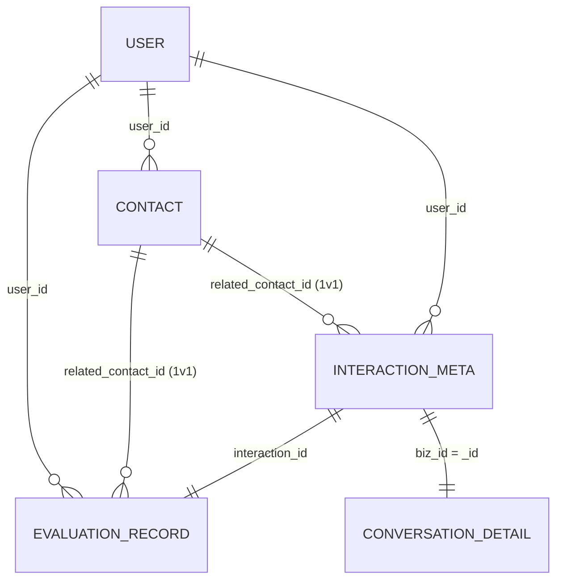

# 阅谈智伴 · 评价体系数据结构设计文档

> 版本：终态合并版。本文档已合并全部历史修订（含 ALTER 与注释精确化），**直接按本文档建表即可，无需对照对话历史打补丁**。
> 适用范围：社交能力评估 / 书友关系 / 交流记录 这条核心数据链（即"评价体系 + 关系图谱"的数据骨架）。
> 不在范围：`user` 账号表（见 §0.3）、前端交互、AI prompt 文本。

---

## 0. 阅读与使用约定

### 0.1 库划分原则（与申报书技术方案第 4 条一致，答辩口径勿偏离）
- **MySQL**：需聚合 / 排序 / 关联 / 强 schema 的数据 → 评估分、书友档案、交流元数据。
- **MongoDB**：嵌套文档 / 长文本流 / 追加式 → 对话逐句明细。
- 原则：**存事实、算派生、评整篇** 三层分离。整篇级 AI 评分与点评进 MySQL；逐句事实与逐句标注进 MongoDB；派生量（所属环、预警级别、交流次数）一律不落库，查询/规则层现算。

### 0.2 全系统命名规则（维度枚举）⚠️ 三方（后端 / 前端 / AI 模块）必须统一
社交能力共 **5 维**，定义一套**短名枚举**，全链路贯通，禁止起别名：

| 短名（枚举值 / JSON 键 / rubric 键） | 含义 | MySQL AI 分列名 |
|---|---|---|
| `clarity` | 表达清晰度 | `score_clarity` |
| `logicality` | 逻辑思辨力 | `score_logicality` |
| `empathy_listening` | 共情与倾听 | `score_empathy_listening` |
| `interactivity` | 互动积极性 | `score_interactivity` |
| `relaxation` | 情绪松弛度 | `score_relaxation` |

映射规则：**维度短名** = 上表左列；**MySQL 列** = `score_` + 短名；**所有 JSON 的键**（如 `self_relative`、rubric 产出、divergence 现算）= 短名。雷达图 / 折线图 / AI 写回 / 前端渲染全部按短名对齐。

### 0.3 user 表边界声明 ⚠️
`user` 账号表**不在本文档定义**，由登录注册模块负责（申报书进度第二阶段第 4 条）。本文档所有 `user_id` 均逻辑外键引用 `user.id`。
- **最小占位约定**（供建表与造 mock 用）：`user.id` = `BIGINT UNSIGNED`，自增主键。
- 本文档**不建物理外键**，全部逻辑外键，应用层保证完整性。

### 0.4 通用约定
- 字符集 `utf8mb4` / 排序 `utf8mb4_unicode_ci` / 引擎 `InnoDB`。
- 所有 `DATETIME` **全系统统一时区**（全 UTC 或全本地，禁止混用，否则折线图跨天错位）。
- 软删表的所有读查询带 `deleted_at IS NULL`。

---

## 1. 实体关系总览



> 补充（erDiagram 不便表达的数组关系）：`interaction_meta.participant_contact_ids[]` → `contact.id`（仅沙龙，非物理外键）。
> 关联闭环：`contact.id` 是 `evaluation.related_contact_id` 与 `interaction_meta.related_contact_id / participant_contact_ids` 的共同指向目标；亲密度按 `user_id + contact.id` 聚合，**不按 user 对 user**。

---

## 2. MySQL · evaluation_record（评估记录，中枢表）

**定位**：雷达图 / 折线图 / 亲密度"深度·质量"分（仅 1 对 1）的数据源。一次复盘或一次模拟 = 一行。

| 字段 | 类型 | 约束 | 说明 |
|---|---|---|---|
| id | BIGINT UNSIGNED | PK, AUTO_INCREMENT | 主键 |
| user_id | BIGINT UNSIGNED | NOT NULL | 被评估用户 → user.id |
| source | TINYINT | NOT NULL | 1=real 真实复盘 / 2=simulation 情景模拟 |
| scene_type | VARCHAR(32) | NOT NULL | salon / one_on_one / library_encounter / sim_xxx … |
| score_clarity | TINYINT UNSIGNED | NOT NULL | 0–100 |
| score_logicality | TINYINT UNSIGNED | NOT NULL | 0–100 |
| score_empathy_listening | TINYINT UNSIGNED | NOT NULL | 0–100 |
| score_interactivity | TINYINT UNSIGNED | NOT NULL | 0–100 |
| score_relaxation | TINYINT UNSIGNED | NOT NULL | 0–100 |
| score_overall | TINYINT UNSIGNED | NOT NULL | AI 加权总分 0–100 |
| ai_analysis_text | TEXT | NULL | AI 整篇文字点评 |
| self_relative | JSON | NULL | 用户每维相对上次：`{"clarity":"up"\|"flat"\|"down", ...}`；不填则整列 NULL |
| self_state | VARCHAR(32) | NULL | 状态标签（**词表挂起**，见 §8） |
| self_comment | VARCHAR(500) | NULL | 用户评语，选填 |
| related_contact_id | BIGINT UNSIGNED | NULL | **one_on_one 填 contact.id；salon / simulation 为 NULL** |
| interaction_id | BIGINT UNSIGNED | NOT NULL | → interaction_meta.id（real 与 sim 均非空） |
| created_at | DATETIME | NOT NULL DEFAULT CURRENT_TIMESTAMP | 评估时间 |
| updated_at | DATETIME | NOT NULL DEFAULT CURRENT_TIMESTAMP ON UPDATE CURRENT_TIMESTAMP | |

**索引**：`idx_user_time(user_id, created_at)`、`idx_user_source(user_id, source)`、`idx_user_contact(user_id, related_contact_id)`。

```sql
CREATE TABLE evaluation_record (
  id                      BIGINT UNSIGNED NOT NULL AUTO_INCREMENT,
  user_id                 BIGINT UNSIGNED NOT NULL                COMMENT '被评估用户->user.id',
  source                  TINYINT         NOT NULL                COMMENT '1=real 2=simulation',
  scene_type              VARCHAR(32)     NOT NULL                COMMENT 'salon/one_on_one/library_encounter/sim_xxx',
  score_clarity           TINYINT UNSIGNED NOT NULL               COMMENT '表达清晰度0-100',
  score_logicality        TINYINT UNSIGNED NOT NULL               COMMENT '逻辑思辨力0-100',
  score_empathy_listening TINYINT UNSIGNED NOT NULL               COMMENT '共情与倾听0-100',
  score_interactivity     TINYINT UNSIGNED NOT NULL               COMMENT '互动积极性0-100',
  score_relaxation        TINYINT UNSIGNED NOT NULL               COMMENT '情绪松弛度0-100',
  score_overall           TINYINT UNSIGNED NOT NULL               COMMENT 'AI加权总分0-100',
  ai_analysis_text        TEXT            NULL                    COMMENT 'AI整篇文字点评',
  self_relative           JSON            NULL                    COMMENT '每维相对上次 up/flat/down,键名=维度短名',
  self_state              VARCHAR(32)     NULL                    COMMENT '状态标签(词表挂起,见文档§8)',
  self_comment            VARCHAR(500)    NULL                    COMMENT '用户评语',
  related_contact_id      BIGINT UNSIGNED NULL                    COMMENT 'one_on_one填contact.id; salon/simulation为NULL',
  interaction_id          BIGINT UNSIGNED NOT NULL                COMMENT '->interaction_meta.id',
  created_at              DATETIME        NOT NULL DEFAULT CURRENT_TIMESTAMP,
  updated_at              DATETIME        NOT NULL DEFAULT CURRENT_TIMESTAMP ON UPDATE CURRENT_TIMESTAMP,
  PRIMARY KEY (id),
  KEY idx_user_time    (user_id, created_at),
  KEY idx_user_source  (user_id, source),
  KEY idx_user_contact (user_id, related_contact_id)
) ENGINE=InnoDB DEFAULT CHARSET=utf8mb4 COLLATE=utf8mb4_unicode_ci
  COMMENT='社交能力评估记录:雷达图/折线图/亲密度(1v1深度质量)数据源';
```

**要点**：
- `score_overall` 第一版等权 = `ROUND(AVG(五维))`，**代码注释必须标明**；将来改加权须迁移历史 overall 或接受折线断层，禁止静默改口径。
- 5 维存整数 TINYINT 是刻意降噪（AI 单次 ±3~5 波动）；移动平均的小数在展示层算，不落库。
- `divergence_flags`（AI 分升降 vs 用户相对自评的背离）**不存表**，详情页查最近几条现算。
- salon 时 `related_contact_id=NULL`：5 维分是用户**整场**表现，进用户雷达图，**不**进任何个人亲密度。

---

## 3. MySQL · contact（书友档案）

**定位**：关系图谱 / 预警 / 通讯录 / 维护建议 的数据源。"我的一个书友" = 一行。

| 字段 | 类型 | 约束 | 说明 |
|---|---|---|---|
| id | BIGINT UNSIGNED | PK, AUTO_INCREMENT | 主键，即他表 related_contact_id 指向值 |
| user_id | BIGINT UNSIGNED | NOT NULL | 档案拥有者 → user.id |
| display_name | VARCHAR(64) | NOT NULL | 显示名/备注，用户自起，同名不拦 |
| avatar_url | VARCHAR(500) | NULL | 头像，图谱节点渲染用 |
| linked_user_id | BIGINT UNSIGNED | NULL | 对方若为本系统用户则 → user.id；**第一版全 NULL，预留** |
| category | VARCHAR(32) | NOT NULL DEFAULT 'other' | 关系分类=图谱扇形（**词表挂起**，见 §8） |
| source_scene | VARCHAR(128) | NULL | 认识来源，如"《XX》读书会 2026-07" |
| intimacy_score | DECIMAL(5,2) | NOT NULL DEFAULT 0.00 | 亲密度连续分 0–100，**物化快照** |
| last_contact_time | DATETIME | NULL | 上次交流时间，时效衰减用 |
| warning_dismissed_at | DATETIME | NULL | "暂不提醒"时间，冷却期内规则跳过 |
| deleted_at | DATETIME | NULL | 软删 |
| created_at / updated_at | DATETIME | NOT NULL | 标准 |

**索引**：`UNIQUE uk_user_linked(user_id, linked_user_id)`、`idx_user_list(user_id, deleted_at, updated_at)`、`idx_user_intimacy(user_id, intimacy_score)`、`idx_user_last(user_id, last_contact_time)`。
> `uk_user_linked`：linked_user_id 为 NULL 时 InnoDB 不去重，正好允许多个手动档案。

```sql
CREATE TABLE contact (
  id                   BIGINT UNSIGNED NOT NULL AUTO_INCREMENT,
  user_id              BIGINT UNSIGNED NOT NULL                COMMENT '档案拥有者->user.id',
  display_name         VARCHAR(64)     NOT NULL                COMMENT '显示名/备注',
  avatar_url           VARCHAR(500)    NULL                    COMMENT '头像url',
  linked_user_id       BIGINT UNSIGNED NULL                    COMMENT '对方若是本系统用户->user.id,预留,第一版全NULL',
  category             VARCHAR(32)     NOT NULL DEFAULT 'other' COMMENT '关系分类=图谱扇形(词表挂起,见§8)',
  source_scene         VARCHAR(128)    NULL                    COMMENT '认识来源',
  intimacy_score       DECIMAL(5,2)    NOT NULL DEFAULT 0.00   COMMENT '亲密度连续分0-100,物化快照',
  last_contact_time    DATETIME        NULL                    COMMENT '上次交流时间,衰减用',
  warning_dismissed_at DATETIME        NULL                    COMMENT '暂不提醒时间,冷却期内跳过',
  deleted_at           DATETIME        NULL                    COMMENT '软删',
  created_at           DATETIME        NOT NULL DEFAULT CURRENT_TIMESTAMP,
  updated_at           DATETIME        NOT NULL DEFAULT CURRENT_TIMESTAMP ON UPDATE CURRENT_TIMESTAMP,
  PRIMARY KEY (id),
  UNIQUE KEY uk_user_linked (user_id, linked_user_id),
  KEY idx_user_list     (user_id, deleted_at, updated_at),
  KEY idx_user_intimacy (user_id, intimacy_score),
  KEY idx_user_last     (user_id, last_contact_time)
) ENGINE=InnoDB DEFAULT CHARSET=utf8mb4 COLLATE=utf8mb4_unicode_ci
  COMMENT='书友档案:关系图谱/预警/通讯录数据源';
```

**要点**：
- **物化 vs 不物化**：`intimacy_score` 物化（时变量，靠定时任务保鲜）；**所属环 ring、预警级别 warning_level、交流次数/频率一律不存**（ring 是 score 的瞬时纯函数，阈值=代码常量，封测改常量即可）。
- 环分桶建议初值（**代码常量，可配置**）：内环 ≥70 / 二环 40–69 / 外环 <40。
- 软删：所有读带 `deleted_at IS NULL`。

---

## 4. MySQL · interaction_meta（交流记录元数据）

**定位**：亲密度"时效 / 频率"来源；评估跳回原始对话的桥梁。一次交流 = 一行（real 与 sim 统一，靠 type 区分）。

| 字段 | 类型 | 约束 | 说明 |
|---|---|---|---|
| id | BIGINT UNSIGNED | PK, AUTO_INCREMENT | 主键，evaluation.interaction_id 指向它 |
| biz_id | VARCHAR(64) | NOT NULL, UNIQUE | 业务幂等键 = Mongo 明细 `_id`，**应用层预生成** |
| user_id | BIGINT UNSIGNED | NOT NULL | 所属用户 → user.id |
| type | TINYINT | NOT NULL | 1=real / 2=simulation |
| scene_type | VARCHAR(32) | NOT NULL | 冗余一份免 join |
| related_contact_id | BIGINT UNSIGNED | NULL | **one_on_one → contact.id；salon / sim → NULL** |
| participant_contact_ids | JSON | NULL | **沙龙在场书友 id 列表 `[c1,c2,…]`；one_on_one / sim 为 NULL** |
| started_at | DATETIME | NOT NULL | 交流开始 |
| ended_at | DATETIME | NULL | 交流结束；衰减用 `COALESCE(ended_at, started_at)`；复盘完成回填 |
| duration_seconds | INT UNSIGNED | NULL | 时长，分析用，不进亲密度核心公式 |
| participant_count | TINYINT UNSIGNED | NULL | 参与人数 |
| process_status | TINYINT | NOT NULL DEFAULT 0 | 0=明细待同步 / 1=全部完成 / 2=明细同步失败(补偿重试) |
| created_at / updated_at | DATETIME | NOT NULL | 标准 |

**索引**：`UNIQUE uk_biz_id(biz_id)`、`idx_user_contact_time(user_id, related_contact_id, started_at)`、`idx_user_started(user_id, started_at)`、`idx_user_type(user_id, type)`、`idx_status(process_status, updated_at)`。

```sql
CREATE TABLE interaction_meta (
  id                    BIGINT UNSIGNED NOT NULL AUTO_INCREMENT,
  biz_id                VARCHAR(64)     NOT NULL                COMMENT '业务幂等键=Mongo明细_id,应用层预生成',
  user_id               BIGINT UNSIGNED NOT NULL                COMMENT '所属用户->user.id',
  type                  TINYINT         NOT NULL                COMMENT '1=real 2=simulation',
  scene_type            VARCHAR(32)     NOT NULL                COMMENT 'salon/one_on_one/library_encounter/sim_xxx',
  related_contact_id    BIGINT UNSIGNED NULL                    COMMENT 'one_on_one->contact.id; salon/sim->NULL',
  participant_contact_ids JSON          NULL                    COMMENT '沙龙在场书友id列表[salon填,one_on_one/sim为NULL]',
  started_at            DATETIME        NOT NULL                COMMENT '交流开始',
  ended_at              DATETIME        NULL                    COMMENT '交流结束,衰减用,复盘时回填',
  duration_seconds      INT UNSIGNED    NULL                    COMMENT '时长,分析用',
  participant_count     TINYINT UNSIGNED NULL                   COMMENT '参与人数',
  process_status        TINYINT         NOT NULL DEFAULT 0      COMMENT '0待同步1完成2同步失败',
  created_at            DATETIME        NOT NULL DEFAULT CURRENT_TIMESTAMP,
  updated_at            DATETIME        NOT NULL DEFAULT CURRENT_TIMESTAMP ON UPDATE CURRENT_TIMESTAMP,
  PRIMARY KEY (id),
  UNIQUE KEY uk_biz_id (biz_id),
  KEY idx_user_contact_time (user_id, related_contact_id, started_at),
  KEY idx_user_started      (user_id, started_at),
  KEY idx_user_type         (user_id, type),
  KEY idx_status            (process_status, updated_at)
) ENGINE=InnoDB DEFAULT CHARSET=utf8mb4 COLLATE=utf8mb4_unicode_ci
  COMMENT='交流记录元数据:亲密度时效/频率来源,评估跳回对话的桥梁';
```

**要点**：
- `biz_id` 不可省：MySQL 自增 id 在 commit 前不可预生成，跨库幂等键必须应用层预生成；Mongo 文档 `_id` 即用 `biz_id`。
- `related_contact_id`（单值，走索引，服务 1 对 1 高频列表）与 `participant_contact_ids`（JSON，服务沙龙低频聚合）**职责正交，非冗余**。
- `process_status` 三态：meta 行**一定存在**（MySQL 先成），补偿任务扫 `status IN (0,2)` 重发 Mongo 即可。

---

## 5. MongoDB · conversation_detail（对话逐句明细，C 收尾）

**定位**：原始对话事实 + 逐句标注。**不放整篇 summary**（整篇级产出在 `evaluation.ai_analysis_text`，避免语义撞车）。real 与 sim 合并同一集合，靠 `meta.type` 区分。

| 字段 | 类型 | 说明 |
|---|---|---|
| _id | string | = `meta.biz_id`，主键 + 幂等 |
| user_id | long | 冗余，免回 mysql |
| type | int | 1 real / 2 sim，冗余 |
| scene_type | string | 冗余 |
| participants | array | 对方列表 `[{ref_id, role, tag}]`；role=contact→ref_id=contact.id,tag=null；role=sim_character→ref_id=null,tag=性格标签。**user 自己不列** |
| sim_context | object\|null | 模拟专属 `{scenario_id, character_persona}`；real 为 null |
| messages | array | 逐句流，结构见下 |
| created_at / updated_at | datetime | |

**messages[] 单条**：

| 字段 | 类型 | 说明 |
|---|---|---|
| seq | int | 句序 |
| ts | datetime\|null | 该句时间 |
| speaker_role | string | user / contact / sim_character / unknown |
| speaker_ref | long\|null | contact_id 或 sim 标识；user / unknown 为 null |
| content | string | 该句文本 |
| annotation | object\|null | `{keywords[], emotion, intent, responds_to_seq}`，AI/规则可选填，标不了则 null |

> `annotation.responds_to_seq` 支撑"共情与倾听"客观指标；`keywords` 支撑申报书"关键词检索语料库"。两者 nullable，**不阻塞写入**。
> `speaker_role=unknown`：沙龙嘈杂识别不出的句子，**不计入任何 contact 亲密度**。

```js
db.createCollection("conversation_detail");
db.conversation_detail.createIndex({ user_id: 1, created_at: 1 });
```

**示例文档（salon，体现多人 + 逐句归属 + unknown）**：
```json
{
  "_id": "BZ202607220001",
  "user_id": 1001, "type": 1, "scene_type": "salon",
  "participants": [
    { "ref_id": 55, "role": "contact", "tag": null },
    { "ref_id": 78, "role": "contact", "tag": null }
  ],
  "sim_context": null,
  "messages": [
    { "seq": 1, "ts": "2026-07-22T19:01:00Z", "speaker_role": "contact", "speaker_ref": 55,
      "content": "我觉得主角的逃避其实是种自我保护。",
      "annotation": { "keywords": ["主角","逃避","自我保护"], "emotion": "平静", "intent": "观点陈述", "responds_to_seq": null } },
    { "seq": 2, "ts": "2026-07-22T19:01:20Z", "speaker_role": "user", "speaker_ref": null,
      "content": "我同意，但书里第三章他明明有机会面对。",
      "annotation": { "keywords": ["第三章","面对"], "emotion": "认同", "intent": "回应+补充", "responds_to_seq": 1 } },
    { "seq": 3, "ts": "2026-07-22T19:01:40Z", "speaker_role": "unknown", "speaker_ref": null,
      "content": "（环境嘈杂未识别发言者）", "annotation": null }
  ],
  "created_at": "2026-07-22T19:05:00Z", "updated_at": "2026-07-22T19:05:00Z"
}
```

**schema 协作**：本集合**写入方为 AI 模块**，`messages[].annotation` 字段名定稿前须与 AI 模块对齐。

---

## 6. 跨库写入流程与一致性

**写入顺序（修正后终态，先 MySQL 后 Mongo）**：
1. 应用层预生成 `biz_id`；
2. 开 **一个 MySQL 事务**：`INSERT interaction_meta`(带 biz_id, status=0) → `INSERT evaluation_record`(interaction_id=meta.id) → `UPDATE contact SET intimacy_score=?, last_contact_time=? WHERE id=?` → **COMMIT**；
3. COMMIT 成功后用 `biz_id` 去 Mongo **upsert** 明细（幂等）；成功置 `process_status=1`，失败置 `2`。

> 顺序理由：MySQL 先成时，不一致方向是"MySQL 有、Mongo 缺"，可由 `process_status` 扫描重试；若反过来先写 Mongo，回滚会产生难发现的孤儿文档。

**两种写入模式**：
- **real 复盘**：MySQL 事务 commit 后整文档 upsert（含完整 messages）。
- **simulation**：模拟开始建 meta(status=0)+Mongo 空文档；每轮 `$push` 一条 message；结束时回填 `ended_at` + 写 evaluation + upsert 最终标注 + status=1。

**补偿任务**：定时扫 `process_status IN (0,2)`，用 `biz_id` 重发 Mongo upsert，成功置 1。**不上 MQ / 分布式事务**（demo 级足够）。

**关键纪律**：
- `contact.intimacy_score` 与 `last_contact_time` 必须与 evaluation **同 MySQL 事务**更新（关系预警不滞后的命门）。
- `contact.last_contact_time` = 该次 `ended_at`；衰减查询统一用 `COALESCE(ended_at, started_at)`。
- 跨库无单一事务，前端展示容忍秒级不一致。

---

## 7. 亲密度计算口径（写 E 的依据，配套说明）

亲密度 = f(时效, 频率, 深度, 质量)，**按 contact 聚合**，按场景区分数据源：

| 场景 | 时效 | 频率 | 深度 / 质量 数据源 |
|---|---|---|---|
| one_on_one | meta.ended_at | count meta | **evaluation 五维**（1 对 1 时用户级=对子级） |
| salon + 有说话人归属 | meta.ended_at | count meta（按 participant_contact_ids 展开） | **conversation_detail 逐句聚合**（user 句 ↔ 该 contact 句 构成互动对），**不可用 evaluation** |
| salon + 无归属（降级） | meta.ended_at | count meta | **不贡献**（仅时效+频率） |
| simulation | — | — | **不计亲密度** |

**时效衰减**：第一版用 **floor**（衰减到下限不清零，保证老友不因久未联系归零）；历史底蕴项留封测评估。衰减率按 `category` 区分（熟人衰减快、亲密关系抗衰减）。

**预警规则（规则引擎，不用大模型）**：沉寂 / 滑落 / 质量 三类；**只预警二环及以上**；每日封顶（如 3 条）；`warning_dismissed_at` 冷却期内跳过。

> ⚠️ TODO（写 E 时处理）：沙龙逐句聚合的"对子深度/质量"与 one_on_one 的 evaluation 整篇分**量纲/标尺可能不一致**，混入同一公式前须做标尺校准或两源分别归一化。
> ⚠️ 沙龙"有归属/无归属"取决于沟通辅助输入形态（**挂起，见 §8**）；schema 已兼容两种，E 的沙龙分支先按降级实现、留接口。

---

## 8. 挂起项与占位策略（vibe coding 不阻塞）

下列项**尚未定稿**，但给出占位策略，建表/造 mock/前端渲染可直接跑通，定稿后仅改词表/常量，不改表结构：

| # | 挂起项 | 占位策略（当前可用） | 定稿后改动 |
|---|---|---|---|
| 1 | `self_state` 状态标签词表 | 前端可不传，列存 NULL；mock 可填 `"relaxed"` 等字符串 | 仅约束枚举值 |
| 2 | `category` 关系分类（图谱扇形） | DDL 已 `DEFAULT 'other'`；mock 可用 `other` | 仅补词表常量 |
| 3 | 隐私部署口径（申报书 7.5 与云端架构的张力） | 默认按**云端**推进（预警定时任务依赖云端）；后端走 repository/service 层抽象，勿写死查云 MySQL | 仅改 service 实现 + 答辩话术 |
| 4 | 沟通辅助输入形态（文字/语音 + 说话人分离）→ 连带决定沙龙多人录入与亲密度沙龙分支 | schema 已兼容（`speaker_ref` 可 unknown、`participant_contact_ids` 可空）；E 沙龙分支先降级 | 仅补 E 沙龙聚合逻辑 |

**环阈值 / 预警阈值 / 衰减参数**：均为**代码常量**，封测校准，不入表。

---

## 附：四表闭环速记

```
evaluation_record ──interaction_id──▶ interaction_meta ──biz_id──▶ conversation_detail(Mongo)
   │ 5维(用户维度)                          │ related_contact_id (1v1)
   │ related_contact_id (1v1)               │ participant_contact_ids (沙龙)
   ▼ 雷达图/折线图                          ▼
   用户能力                          contact ◀── intimacy_score / last_contact_time
                                     关系图谱/预警/通讯录
                                              ▲
              亲密度定时任务：按 contact 聚合 meta(时效/频率) + 深度质量(1v1读evaluation / 沙龙读逐句)
```