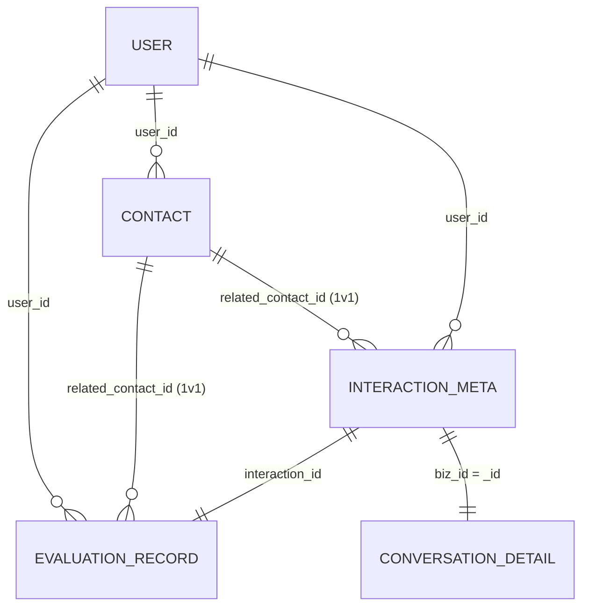

# 阅谈智伴 · 评价体系数据结构设计文档（修订版）

> **修订说明**：基于文档与现有代码交叉审计后，对 §3 contact 表做了以下修订 —
> 1. `display_name` → `name`（保留现状命名，含义不变）
> 2. 新增 `relation_type` 字段（社交身份，与 `category` 正交两维度并存）
> 3. 新增 `personality`、`interests`、`labels` 三个字段（Plan A，保留现有代码依赖）
> 4. 评分维度 5 维维持原文档设计不变
>
> 版本：终态合并版（含本次修订）。直接按本文档建表即可。
> 适用范围：社交能力评估 / 书友关系 / 交流记录 这条核心数据链。
> 不在范围：`user` 账号表（见 §0.3）、前端交互、AI prompt 文本。

---

## 0. 阅读与使用约定

### 0.1 库划分原则
- **MySQL**：需聚合 / 排序 / 关联 / 强 schema 的数据 → 评估分、书友档案、交流元数据。
- **MongoDB**：嵌套文档 / 长文本流 / 追加式 → 对话逐句明细。
- 原则：**存事实、算派生、评整篇** 三层分离。

### 0.2 全系统命名规则（维度枚举）
社交能力共 **5 维**，全链路贯通，禁止起别名：

| 短名（枚举值 / JSON 键 / rubric 键） | 含义 | MySQL AI 分列名 |
|---|---|---|
| `clarity` | 表达清晰度 | `score_clarity` |
| `logicality` | 逻辑思辨力 | `score_logicality` |
| `empathy_listening` | 共情与倾听 | `score_empathy_listening` |
| `interactivity` | 互动积极性 | `score_interactivity` |
| `relaxation` | 情绪松弛度 | `score_relaxation` |

### 0.3 user 表边界声明
`user` 账号表不在本文档定义。所有 `user_id` 均逻辑外键引用 `user.id`。最小占位约定：`user.id` = `BIGINT UNSIGNED`，自增主键。本文档不建物理外键，应用层保证完整性。

### 0.4 通用约定
- 字符集 `utf8mb4` / 排序 `utf8mb4_unicode_ci` / 引擎 `InnoDB`。
- 所有 `DATETIME` 全系统统一时区。
- 软删表的所有读查询带 `deleted_at IS NULL`。

---

## 1. 实体关系总览



---

## 2. MySQL · evaluation_record（评估记录，中枢表）

**定位**：雷达图 / 折线图 / 亲密度"深度·质量"分（仅 1 对 1）的数据源。

| 字段 | 类型 | 约束 | 说明 |
|---|---|---|---|
| id | BIGINT UNSIGNED | PK, AUTO_INCREMENT | 主键 |
| user_id | BIGINT UNSIGNED | NOT NULL | 被评估用户 → user.id |
| source | TINYINT | NOT NULL | 1=real 真实复盘 / 2=simulation 情景模拟 |
| scene_type | VARCHAR(32) | NOT NULL | salon / one_on_one / library_encounter / sim_xxx |
| score_clarity | TINYINT UNSIGNED | NOT NULL | 0–100 |
| score_logicality | TINYINT UNSIGNED | NOT NULL | 0–100 |
| score_empathy_listening | TINYINT UNSIGNED | NOT NULL | 0–100 |
| score_interactivity | TINYINT UNSIGNED | NOT NULL | 0–100 |
| score_relaxation | TINYINT UNSIGNED | NOT NULL | 0–100 |
| score_overall | TINYINT UNSIGNED | NOT NULL | AI 加权总分 0–100 |
| ai_analysis_text | TEXT | NULL | AI 整篇文字点评 |
| self_relative | JSON | NULL | 用户每维相对上次 up/flat/down |
| self_state | VARCHAR(32) | NULL | 状态标签（词表挂起，见 §8） |
| self_comment | VARCHAR(500) | NULL | 用户评语，选填 |
| related_contact_id | BIGINT UNSIGNED | NULL | one_on_one 填 contact.id；salon / simulation 为 NULL |
| interaction_id | BIGINT UNSIGNED | NOT NULL | → interaction_meta.id |
| created_at | DATETIME | NOT NULL DEFAULT CURRENT_TIMESTAMP | |
| updated_at | DATETIME | NOT NULL DEFAULT CURRENT_TIMESTAMP ON UPDATE CURRENT_TIMESTAMP | |

**索引**：`idx_user_time(user_id, created_at)`、`idx_user_source(user_id, source)`、`idx_user_contact(user_id, related_contact_id)`。

```sql
CREATE TABLE evaluation_record (
  id                      BIGINT UNSIGNED NOT NULL AUTO_INCREMENT,
  user_id                 BIGINT UNSIGNED NOT NULL                COMMENT '被评估用户->user.id',
  source                  TINYINT         NOT NULL                COMMENT '1=real 2=simulation',
  scene_type              VARCHAR(32)     NOT NULL                COMMENT 'salon/one_on_one/library_encounter/sim_xxx',
  score_clarity           TINYINT UNSIGNED NOT NULL               COMMENT '表达清晰度0-100',
  score_logicality        TINYINT UNSIGNED NOT NULL               COMMENT '逻辑思辨力0-100',
  score_empathy_listening TINYINT UNSIGNED NOT NULL               COMMENT '共情与倾听0-100',
  score_interactivity     TINYINT UNSIGNED NOT NULL               COMMENT '互动积极性0-100',
  score_relaxation        TINYINT UNSIGNED NOT NULL               COMMENT '情绪松弛度0-100',
  score_overall           TINYINT UNSIGNED NOT NULL               COMMENT 'AI加权总分0-100',
  ai_analysis_text        TEXT            NULL                    COMMENT 'AI整篇文字点评',
  self_relative           JSON            NULL                    COMMENT '每维相对上次 up/flat/down,键名=维度短名',
  self_state              VARCHAR(32)     NULL                    COMMENT '状态标签(词表挂起,见文档§8)',
  self_comment            VARCHAR(500)    NULL                    COMMENT '用户评语',
  related_contact_id      BIGINT UNSIGNED NULL                    COMMENT 'one_on_one填contact.id; salon/simulation为NULL',
  interaction_id          BIGINT UNSIGNED NOT NULL                COMMENT '->interaction_meta.id',
  created_at              DATETIME        NOT NULL DEFAULT CURRENT_TIMESTAMP,
  updated_at              DATETIME        NOT NULL DEFAULT CURRENT_TIMESTAMP ON UPDATE CURRENT_TIMESTAMP,
  PRIMARY KEY (id),
  KEY idx_user_time    (user_id, created_at),
  KEY idx_user_source  (user_id, source),
  KEY idx_user_contact (user_id, related_contact_id)
) ENGINE=InnoDB DEFAULT CHARSET=utf8mb4 COLLATE=utf8mb4_unicode_ci
  COMMENT='社交能力评估记录:雷达图/折线图/亲密度(1v1深度质量)数据源';
```

**要点**：
- `score_overall` 第一版等权 = `ROUND(AVG(五维))`；将来改加权需迁移历史 overall 或接受折线断层。
- 5 维存整数 TINYINT 是刻意降噪；移动平均的小数在展示层算，不落库。
- `divergence_flags` 不存表，详情页查最近几条现算。
- salon 时 `related_contact_id=NULL`：5 维分是用户整场表现，不进任何个人亲密度。

---

## 3. MySQL · contact（书友档案）🔴 已修订

**定位**：关系图谱 / 预警 / 通讯录 / 维护建议 的数据源。"我的一个书友" = 一行。

| 字段 | 类型 | 约束 | 说明 |
|---|---|---|---|
| id | BIGINT UNSIGNED | PK, AUTO_INCREMENT | 主键，即他表 related_contact_id 指向值 |
| user_id | BIGINT UNSIGNED | NOT NULL | 档案拥有者 → user.id |
| name | VARCHAR(64) | NOT NULL | 显示名/备注，用户自起，同名不拦 |
| avatar_url | VARCHAR(500) | NULL | 头像，图谱节点渲染用 |
| linked_user_id | BIGINT UNSIGNED | NULL | 对方若为本系统用户则 → user.id；第一版全 NULL，预留 |
| category | VARCHAR(32) | NOT NULL DEFAULT 'other' | 关系分类=图谱扇形=书友圈，如"科幻文学""历史人文"（词表挂起，见 §8） |
| relation_type | VARCHAR(32) | NOT NULL DEFAULT 'other' | 社交身份，如"家人""朋友""同事""同学"（与 category 正交，两维度并存） |
| source_scene | VARCHAR(128) | NULL | 认识来源，如"《XX》读书会 2026-07" |
| personality | VARCHAR(200) | NULL | 性格描述，如"幽默风趣社牛""沉稳内敛观察者" |
| interests | JSON | NULL | 兴趣爱好数组，如 `["阅读","咖啡","摄影"]` |
| labels | JSON | NULL | 关系/身份标签数组，如 `["好友","大学同学"]` |
| intimacy_score | DECIMAL(5,2) | NOT NULL DEFAULT 0.00 | 亲密度连续分 0–100，物化快照 |
| last_contact_time | DATETIME | NULL | 上次交流时间，时效衰减用 |
| warning_dismissed_at | DATETIME | NULL | "暂不提醒"时间，冷却期内规则跳过 |
| deleted_at | DATETIME | NULL | 软删 |
| created_at / updated_at | DATETIME | NOT NULL | 标准 |

**索引**：`UNIQUE uk_user_linked(user_id, linked_user_id)`、`idx_user_list(user_id, deleted_at, updated_at)`、`idx_user_intimacy(user_id, intimacy_score)`、`idx_user_last(user_id, last_contact_time)`。

```sql
CREATE TABLE contact (
  id                   BIGINT UNSIGNED NOT NULL AUTO_INCREMENT,
  user_id              BIGINT UNSIGNED NOT NULL                COMMENT '档案拥有者->user.id',
  name                 VARCHAR(64)     NOT NULL                COMMENT '显示名/备注',
  avatar_url           VARCHAR(500)    NULL                    COMMENT '头像url',
  linked_user_id       BIGINT UNSIGNED NULL                    COMMENT '对方若是本系统用户->user.id,预留,第一版全NULL',
  category             VARCHAR(32)     NOT NULL DEFAULT 'other' COMMENT '关系分类=图谱扇形=书友圈(词表挂起,见§8)',
  relation_type        VARCHAR(32)     NOT NULL DEFAULT 'other' COMMENT '社交身份:家人/朋友/同事/同学(与category正交)',
  source_scene         VARCHAR(128)    NULL                    COMMENT '认识来源',
  personality          VARCHAR(200)    NULL                    COMMENT '性格描述',
  interests            JSON            NULL                    COMMENT '兴趣爱好数组',
  labels               JSON            NULL                    COMMENT '关系/身份标签数组',
  intimacy_score       DECIMAL(5,2)    NOT NULL DEFAULT 0.00   COMMENT '亲密度连续分0-100,物化快照',
  last_contact_time    DATETIME        NULL                    COMMENT '上次交流时间,衰减用',
  warning_dismissed_at DATETIME        NULL                    COMMENT '暂不提醒时间,冷却期内跳过',
  deleted_at           DATETIME        NULL                    COMMENT '软删',
  created_at           DATETIME        NOT NULL DEFAULT CURRENT_TIMESTAMP,
  updated_at           DATETIME        NOT NULL DEFAULT CURRENT_TIMESTAMP ON UPDATE CURRENT_TIMESTAMP,
  PRIMARY KEY (id),
  UNIQUE KEY uk_user_linked (user_id, linked_user_id),
  KEY idx_user_list     (user_id, deleted_at, updated_at),
  KEY idx_user_intimacy (user_id, intimacy_score),
  KEY idx_user_last     (user_id, last_contact_time)
) ENGINE=InnoDB DEFAULT CHARSET=utf8mb4 COLLATE=utf8mb4_unicode_ci
  COMMENT='书友档案:关系图谱/预警/通讯录数据源';
```

**要点**：
- **两维度并存**：`category` = 书友圈扇区（图谱用），`relation_type` = 社交身份（列表/通讯录用），互不替代。
- **物化 vs 不物化**：`intimacy_score` 物化（时变量，靠定时任务保鲜）；所属环 ring、预警级别 warning_level、交流次数/频率一律不存。
- 环分桶建议初值：内环 ≥70 / 二环 40–69 / 外环 <40。
- 软删：所有读带 `deleted_at IS NULL`。

---

## 4. MySQL · interaction_meta（交流记录元数据）

（内容与原始文档一致，未修改）

## 5. MongoDB · conversation_detail（对话逐句明细）

（内容与原始文档一致，未修改）

## 6. 跨库写入流程与一致性

（内容与原始文档一致，未修改）

## 7. 亲密度计算口径

（内容与原始文档一致，未修改）

## 8. 挂起项与占位策略

（内容与原始文档一致，未修改）

## 附：四表闭环速记

```
evaluation_record ──interaction_id──▶ interaction_meta ──biz_id──▶ conversation_detail(MongoDB)
   │ 5维(用户维度)                          │ related_contact_id (1v1)
   │ related_contact_id (1v1)               │ participant_contact_ids (沙龙)
   ▼ 雷达图/折线图                          ▼
   用户能力                          contact ◀── intimacy_score / last_contact_time
                                    关系图谱/预警/通讯录
                                           │ name / avatar_url / category / relation_type
                                           │ personality / interests / labels
                                           ▼ 图谱扇形 + 社交身份 + 性格/兴趣/标签
```
